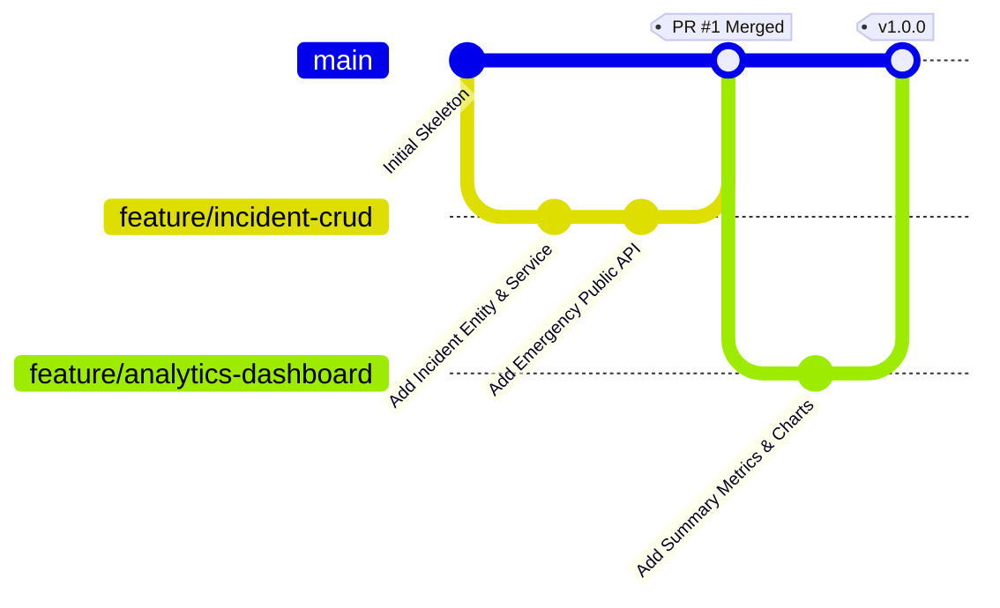

# Git Branching and Contribution Policy

This repository adheres to the **GitHub Flow** branching model with strict pull request reviews, automated CI checks, and semantic version tagging.

## 1. Branch Structure

- **`main`**: The primary production-ready branch. Code on `main` must always build cleanly, pass all unit and Selenium tests, and be deployable to production.
- **`feature/<feature-name>`**: Dedicated short-lived branch for developing new capabilities or user stories.
  - Examples: `feature/incident-crud`, `feature/analytics-dashboard`, `feature/live-chat`
- **`bugfix/<bug-name>`**: Dedicated branch for fixing defect reports.
  - Examples: `bugfix/jwt-expiration`, `bugfix/spa-routing`
- **`hotfix/<issue-name>`**: Critical urgent production fixes branched directly off `main`.

## 2. Branch Naming Rules

1. All lowercase alphanumeric characters separated by hyphens (`-`).
2. Must prefix with `feature/`, `bugfix/`, or `hotfix/`.
3. Keep names descriptive but concise (max 30 characters after prefix).

## 3. Workflow Lifecycle



### Steps:
1. **Branch Out**: Create a feature branch off the latest `main`:
   ```bash
   git checkout main
   git pull origin main
   git checkout -b feature/incident-crud
   ```
2. **Commit Often**: Use standard conventional commit format:
   ```bash
   git commit -m "feat(incident): implement round-robin technician auto assignment"
   ```
3. **Push and Open PR**:
   ```bash
   git push origin feature/incident-crud
   ```
4. **Automated Verification**: Jenkins CI verifies build, unit tests, and Selenium regressions.
5. **Code Review**: At least one peer review approval required.
6. **Merge**: Squash or rebase merge into `main`.
7. **Release Tagging**: Tag release baseline:
   ```bash
   git tag -a v1.0.0 -m "Release v1.0.0 - Full Roadside Assistance Portal MVP"
   git push origin v1.0.0
   ```
