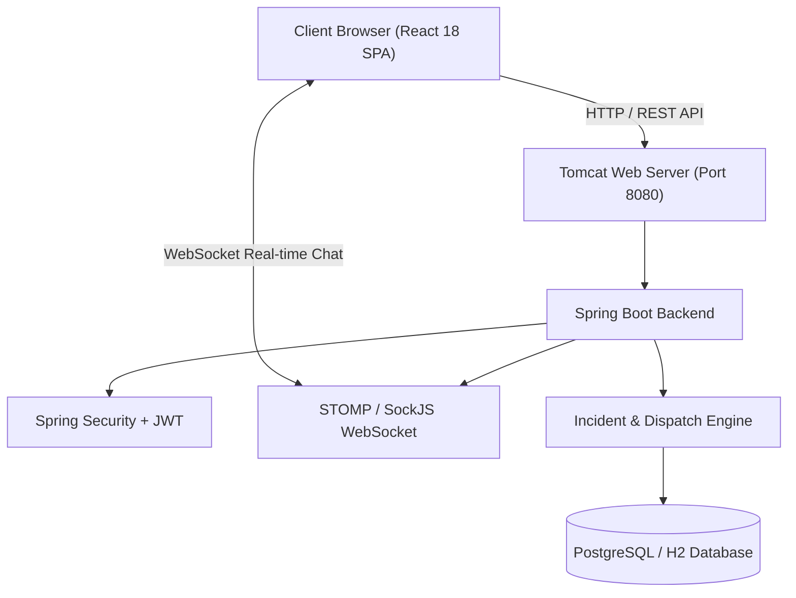

# 🚗 Roadside Assistance Portal (Road Helper)

[](https://github.com/mananch1/highway-ami)
[](https://www.oracle.com/java/)
[](https://spring.io/projects/spring-boot)
[-blue.svg)](https://react.dev/)
[](https://www.docker.com/)
[](LICENSE)

An enterprise-grade, cloud-native **Roadside Assistance Portal** with real-time technician auto-dispatch, live incident tracking, STOMP/WebSocket chat, role-based workflows, and automated emergency service notifications. Built as an end-to-end DevOps pipeline showcase.

---

## 📌 Project Overview

- **Student:** Manan Chahal (Roll No: 23102C0044)
- **Class / Division:** BE VII - Division C
- **Course:** DevOps Engineering Lab Project
- **Project Title:** DevOps Pipeline for a Roadside Assistance Portal
- **Repository:** [https://github.com/mananch1/highway-ami](https://github.com/mananch1/highway-ami)

---

## 🏗️ Architecture & Technology Stack



### Core Technologies
- **Backend:** Java 21, Spring Boot 4.x / 3.x, Spring Data JPA, Spring Security, Spring WebSocket (STOMP + SockJS)
- **Frontend:** React 18, Vite, React Router 6, Axios, Recharts, SockJS-Client, StompJs
- **Database:** PostgreSQL (Production / Docker), H2 In-Memory (Automated CI Testing)
- **Testing:** JUnit 5, Mockito, Selenium WebDriver 4.x (Headless Chrome/Edge with failure screenshots)
- **CI/CD:** Jenkins Declarative Pipeline (`Jenkinsfile`), Docker, Docker Hub (`mananch1/road-helper`)
- **Configuration Management:** Ansible (`inventory.ini`, `playbook.yml`, `rollback.yml`)

---

## 🚀 Key Features

1. **Dual-Mode Access**:
   - **Emergency Public Flow (`/` & `/emergency`)**: Instant 1-click roadside request without registration. Issues temporary guest session tokens for status tracking and live communication.
   - **Full Role-Based Portal**: Secure JWT authentication for Customers, Technicians, and Administrators.
2. **Automated Dispatch Algorithm**:
   - Round-robin queue automatically assigns closest available technician upon incident creation.
   - Re-enables technician availability upon incident resolution.
3. **Simulated Multi-Agency Dispatch**:
   - Auto-triggers mock notifications to Tow Truck, Police, Ambulance, Locksmith, or Fuel Services based on incident category (`FLAT_TIRE`, `ACCIDENT`, `ENGINE_FAILURE`, etc.).
4. **Real-Time Interactive Chat**:
   - WebSocket (STOMP over SockJS) communication channel dedicated to each active incident between driver and technician.
5. **Interactive Executive Dashboard**:
   - Live metrics, incident breakdown by category and status (Recharts), technician availability counters, and recent activity log.

---

## 🛠️ Local Development & Quickstart

### Prerequisites
- JDK 21+
- Node.js v20+ & npm 10+
- Git

### 1. Run Backend & Frontend in Development Mode
```bash
# Clone the repository
git clone https://github.com/mananch1/highway-ami.git
cd highway-ami

# Run backend with Maven wrapper
./mvnw clean spring-boot:run
```
Access the application at `http://localhost:8080/`.

### 2. Standalone React Development
```bash
cd frontend
npm install
npm run dev
```

---

## 🧪 Testing Suite

### 1. Unit & Service Tests
```bash
./mvnw test -Dtest=IncidentServiceTest,RoadHelperApplicationTests
```

### 2. End-to-End Selenium WebDriver Tests (5 Critical Journeys)
```bash
./mvnw test -Dtest=RoadHelperSeleniumIT
```
> [!NOTE]
> All Selenium journeys run headless in Chrome or Edge. Any test failure automatically captures a full-page diagnostic screenshot in `target/screenshots/`.

---

## 🚢 DevOps Lifecycle & Automation

| Component | Technology | Artifact / Config |
|-----------|------------|-------------------|
| **Version Control** | GitHub Flow | `BRANCHING.md`, `.github/` |
| **Continuous Integration** | Jenkins Declarative Pipeline | `Jenkinsfile` |
| **Testing Quality Gate** | Selenium WebDriver | `src/test/.../RoadHelperSeleniumIT.java` |
| **Containerization** | Multi-Stage Dockerfile | `Dockerfile`, `docker-compose.yml` |
| **Container Registry** | Docker Hub | `mananch1/road-helper:latest` |
| **Continuous Delivery** | Jenkins Docker CD | `Jenkinsfile.docker` |
| **Config Management** | Ansible Playbooks | `ansible/playbook.yml`, `ansible/rollback.yml` |

---

## 📄 License
This project is open-source under the [MIT License](LICENSE).
