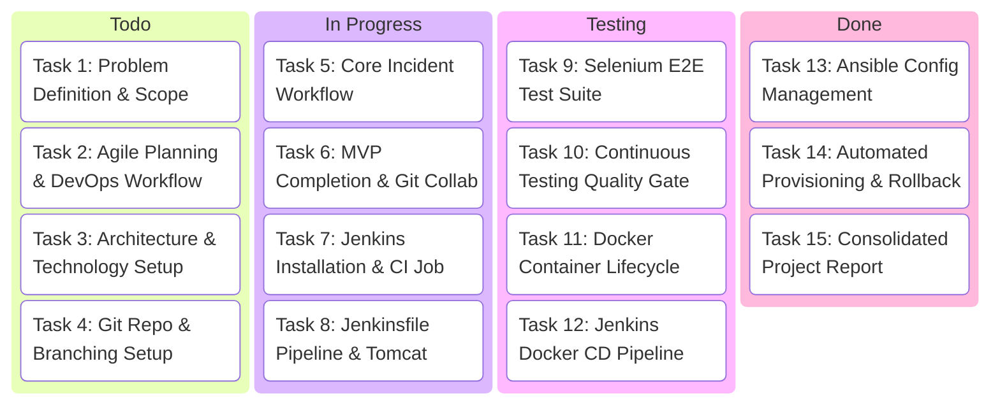

# Task 2: Agile Planning and DevOps Workflow

**Student:** Manan Chahal (Roll No: 23102C0044)  
**Project Title:** DevOps Pipeline for a Roadside Assistance Portal  
**Class/Division:** BE VII - Division C  

---

## 1. User Stories & Acceptance Criteria

### User Story 1: Emergency Public Assistance Request
- **As a** stranded driver in an emergency,
- **I want to** submit a roadside assistance request immediately with my name, phone number, location, and incident type without registering an account,
- **So that** help can be dispatched to my location immediately.
- **Acceptance Criteria**:
  1. Accessible at public route `/` and `/emergency` without requiring login.
  2. Form accepts Name, Phone, Location, Incident Type, and Description.
  3. System creates incident with `REQUESTED` status and returns an emergency tracking token.
  4. User is redirected to `/emergency/status?token=...` displaying live status.

### User Story 2: Automated Dispatch & Auto-Assignment
- **As an** operations dispatcher,
- **I want** the system to automatically assign newly requested incidents to the next available technician,
- **So that** incidents are dispatched without manual intervention delay.
- **Acceptance Criteria**:
  1. When an incident is logged, available technicians (`isAvailable = true`) are queried.
  2. The next technician in queue is assigned; incident status becomes `AUTO_ASSIGNED`.
  3. Assigned technician's availability is marked `false`.

### User Story 3: Real-Time Communication
- **As a** driver and assigned technician,
- **I want to** exchange live text messages within the incident view,
- **So that** we can communicate arrival estimates, vehicle landmarks, and assistance instructions.
- **Acceptance Criteria**:
  1. WebSocket channel opens over `/ws` and subscribes to `/topic/chat/{incidentId}`.
  2. Messages sent via `/app/chat/{incidentId}` are persisted to database and broadcast in real-time.
  3. Supports both authenticated users and guest token holders.

### User Story 4: Technician Status Workflow
- **As a** field technician,
- **I want to** update the incident status from `AUTO_ASSIGNED` to `IN_PROGRESS` and `RESOLVED`,
- **So that** all parties have full transparency over current operation stage.
- **Acceptance Criteria**:
  1. Technician dashboard lists assigned incidents.
  2. Technician can transition status to `IN_PROGRESS` upon dispatch and `RESOLVED` upon completion.
  3. Marking incident `RESOLVED` records resolution timestamp and resets technician availability to `true`.

### User Story 5: Operational Analytics Dashboard
- **As an** administrator,
- **I want to** view real-time KPIs including total incident volume, breakdown by status, breakdown by emergency type, and average resolution time,
- **So that** I can assess fleet efficiency and response bottlenecks.
- **Acceptance Criteria**:
  1. Access restricted to `ADMIN` role.
  2. Displays summary statistics cards and visual charts (Recharts Pie and Bar charts).
  3. Shows recent 10 incidents table with clickable detail view.

---

## 2. Product Backlog & 15-Task Kanban Board

---

## 3. Definition of Done (DoD)

A backlog item or task is considered **Done** only when:
1. **Code Complete**: All entity, DTO, service, controller, and frontend components implemented without placeholders.
2. **Local Compilation**: Clean build verified via `mvn clean compile` and `npm run build`.
3. **Automated Unit Testing**: Service unit tests pass with 100% assertions satisfied.
4. **Automated Selenium Quality Gate**: Headless Selenium tests pass for all 5 user journeys with zero regressions.
5. **CI/CD Integration**: Committed code builds and packages cleanly in Jenkins pipeline.
6. **Artifact Generation**: Deployable WAR artifact created and archived.
7. **Documentation**: Task deliverable document compiled with architecture diagrams, logs, and evidence.

---

## 4. End-to-End DevOps Lifecycle Diagram

```mermaid
flowchart LR
    subgraph Plan_and_Code ["1. Plan & Code"]
        Git["Git / GitHub Flow"] --> PR["Pull Request Review"]
    end

    subgraph Continuous_Integration ["2. Continuous Integration"]
        PR --> Jenkins["Jenkins CI Pipeline"]
        Jenkins --> Build["Maven & Vite Build"]
        Build --> Unit["JUnit 5 Tests"]
    end

    subgraph Continuous_Testing ["3. Continuous Testing"]
        Unit --> Selenium["Selenium E2E Suite"]
        Selenium --> QualityGate{"Pass Quality Gate?"}
    end

    subgraph Continuous_Delivery ["4. Continuous Delivery"]
        QualityGate -->|Yes| Docker["Build & Tag Docker Image"]
        QualityGate -->|No| Stop["Abort Pipeline & Screenshot Alert"]
        Docker --> Hub["Push to Docker Hub"]
    end

    subgraph Automated_Operations ["5. Automated Operations"]
        Hub --> Ansible["Ansible Playbook Provisioning"]
        Ansible --> Deploy["Deploy Container to Target Server"]
        Deploy --> Health["Automated Healthcheck & Rollback"]
    end
```

