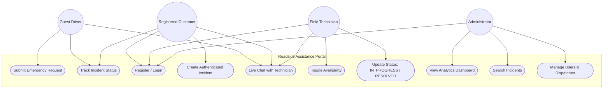
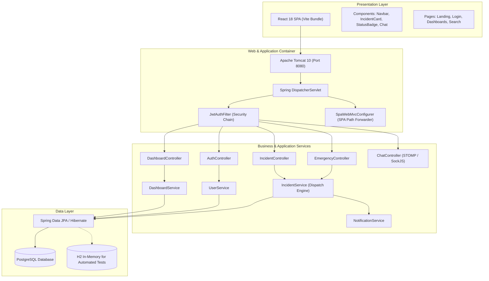
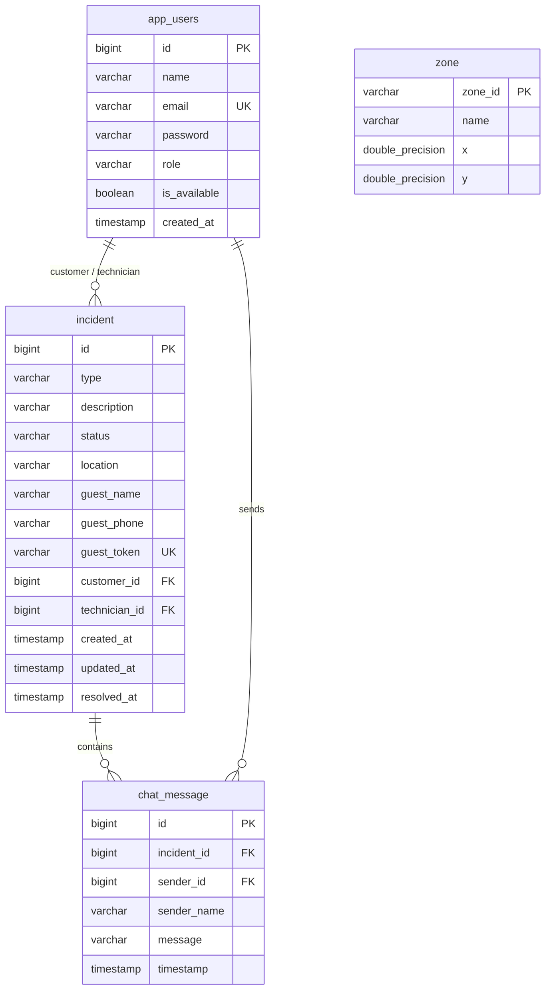

# Task 3: Requirements, Architecture and Technology Setup

**Student:** Manan Chahal (Roll No: 23102C0044)  
**Project Title:** DevOps Pipeline for a Roadside Assistance Portal  
**Class/Division:** BE VII - Division C  

---

## 1. System Requirements Specification (SRS) Summary

### Functional Requirements
- **FR-01 (Authentication & Access)**: User registration and login with BCrypt password hashing and JWT issuance. Role-based authorization (`CUSTOMER`, `TECHNICIAN`, `ADMIN`).
- **FR-02 (Guest Emergency Request)**: Direct assistance submission requiring only name, contact number, location, and incident category without pre-registration.
- **FR-03 (Automated Dispatch)**: Round-robin queue allocation matching pending incidents to available field technicians.
- **FR-04 (Role-Based Status Management)**: Enforced state transitions (`REQUESTED` -> `AUTO_ASSIGNED` -> `IN_PROGRESS` -> `RESOLVED` -> `CLOSED` / `CANCELLED`).
- **FR-05 (Search & Filter)**: Keyword query support over incident descriptions and geographic locations.
- **FR-06 (Analytics Dashboard)**: Aggregated KPI calculations for administrators (totals, status distributions, category distributions, average resolution time).
- **FR-07 (Live Chat)**: Real-time STOMP WebSocket pub/sub message exchange per incident session.

### Non-Functional Requirements
- **NFR-01 (Portability)**: Cross-platform deployment via standard WAR on Apache Tomcat 10 and multi-stage Docker container.
- **NFR-02 (Stateless Scalability)**: Stateless REST API secured by JWT tokens, allowing horizontal scaling.
- **NFR-03 (Automated Testing)**: Unit and E2E Selenium regressions executable in headless mode in local and CI environments.

---

## 2. Use-Case Diagram

---

## 3. Minimum Application Architecture Diagram

---

## 4. Data Model Specification

---

## 5. API Endpoints Catalog

| HTTP Method | URI Endpoint | Authentication | Purpose |
|-------------|--------------|----------------|---------|
| `POST` | `/api/v1/auth/register` | Public | Register new user account |
| `POST` | `/api/v1/auth/login` | Public | Authenticate user, receive JWT token |
| `POST` | `/api/v1/emergency` | Public | Submit emergency request, receive tracking token |
| `GET` | `/api/v1/emergency/status?token=` | Public | View guest incident status |
| `GET` | `/api/v1/incidents` | JWT (`CUSTOMER`, `TECH`, `ADMIN`) | List incidents filtered by role |
| `POST` | `/api/v1/incidents` | JWT (`CUSTOMER`) | Create authenticated incident |
| `GET` | `/api/v1/incidents/{id}` | JWT / Guest | Retrieve incident detail |
| `PATCH` | `/api/v1/incidents/{id}/status` | JWT (`TECH`, `ADMIN`) | Transition workflow status |
| `GET` | `/api/v1/incidents/search?query=` | JWT (`ADMIN`, `TECH`) | Search by query string |
| `GET` | `/api/v1/dashboard/summary` | JWT (`ADMIN`) | Get operational analytics and KPIs |
| `GET` | `/api/v1/users` | JWT (`ADMIN`) | List technicians |
| `PATCH` | `/api/v1/users/{id}/availability` | JWT (`TECH`) | Toggle technician active status |
| `GET` | `/api/v1/incidents/{id}/chat` | JWT / Guest | Fetch chat message history |
| `WS` | `/ws` -> `/app/chat/{id}` | STOMP / SockJS | Send real-time chat message |
