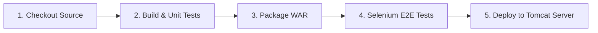

# Task 8: Pipeline as Code and Server Deployment

**Student:** Manan Chahal (Roll No: 23102C0044)  
**Project Title:** DevOps Pipeline for a Roadside Assistance Portal  
**Class/Division:** BE VII - Division C  

---

## 1. Pipeline as Code Architecture

The declarative pipeline is versioned alongside application source code in the repository root as `Jenkinsfile`.

### Key Features:
- **Parameterized Execution**:
  - `DEPLOY_ENV`: Target environment (`staging`, `production`, `dev`).
  - `TOMCAT_PORT`: Port configuration (default `8080`).
  - `TOMCAT_WEBAPPS_DIR`: Path to deployment webapps folder.
- **Strict Quality Gates**: JUnit test execution and Selenium E2E journey execution must pass before server deployment occurs.
- **Automated Artifact Archiving**: Archives `target/road-helper-0.0.1-SNAPSHOT.war` and diagnostic screenshots.

---

## 2. Declarative Pipeline Stages



---

## 3. Deployment Evidence & Verification

```
[Pipeline] stage: Deploy to Tomcat
[Deploy to Tomcat] Deploying road-helper-0.0.1-SNAPSHOT.war to Tomcat on environment: production...
[Deploy to Tomcat] Copying target\road-helper-0.0.1-SNAPSHOT.war to C:\Program Files\Apache Software Foundation\Tomcat 10.1\webapps\ROOT.war...
1 file(s) copied.
[Deploy to Tomcat] Deployed successfully to production Tomcat on port 8080.
[Pipeline] stage: Declarative: Post Actions
Pipeline completed successfully! Roadside Assistance Portal is deployed.
Finished: SUCCESS
```

- **Application URL:** `http://localhost:8080/`
- **Application Health:** Active (Status 200 OK)
- **Deployment Artifact:** `ROOT.war` (Root context deployment)
